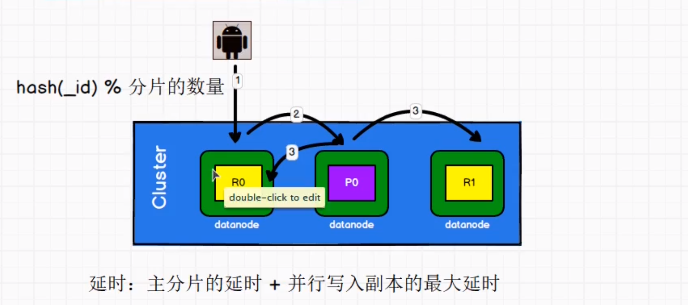
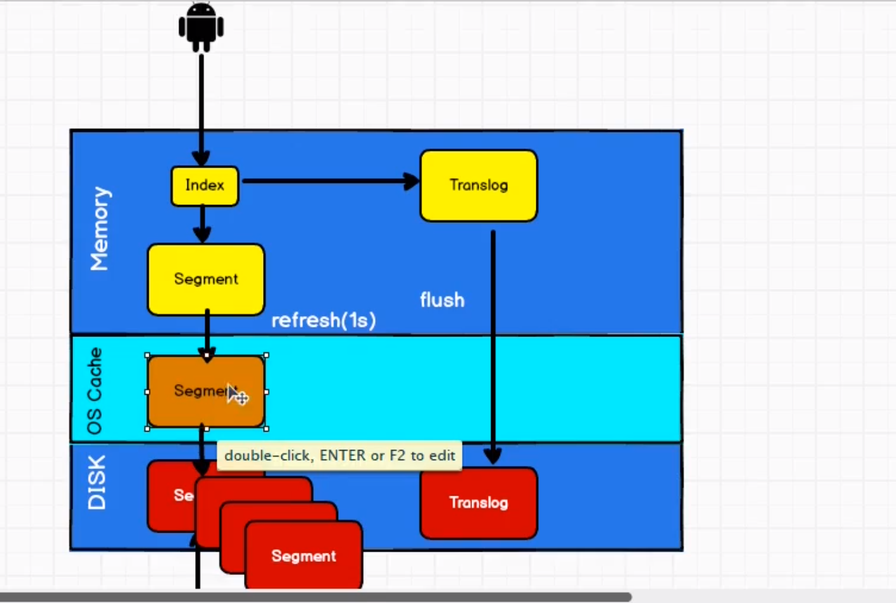
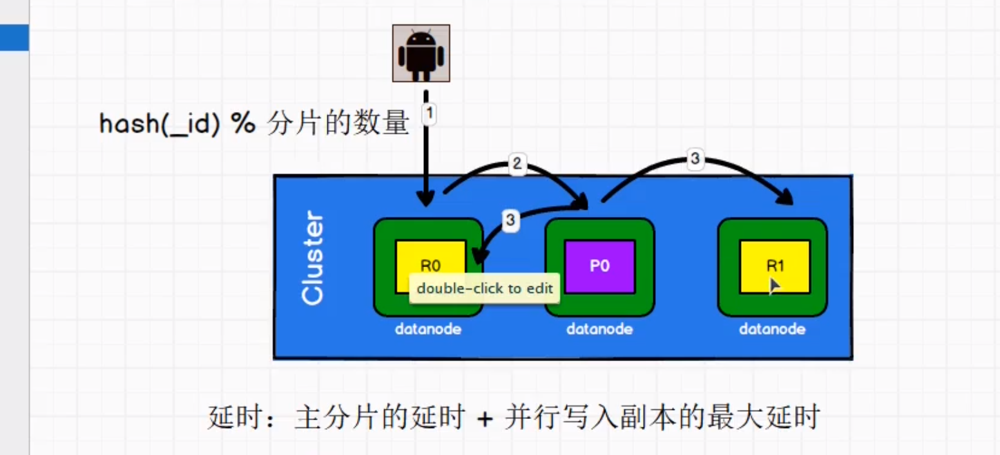

es 优化技巧

es 基础是 Lucene

1.调整一些参数 硬件选择 提升io效率 使用ssd 固态硬盘 使用RAID 0 使用多块硬盘 是不用NFS 远程挂载

2. 分片策略 合理设置分片策略，分片提供分布式和故障转移的特性。但如果多个分片在同一个节点会互相竞争，需要根据业务的增长趋势，来进行判断 进行横向扩展
    * 控制每个分片的硬盘的容量不超过es的最大jvm xmax 的容量
    * 考虑node的数量，分片数不超过节点数的3倍（即9分片对于3节点）
    * 主分片 节点数 《= 主分片 *（副本数 +1）

3. 推迟延迟分片
    * 节点瞬时中断 ，集群会有1分钟查看判断该节点是会重新加入 重新加入 ，恢复原有数据 不加入 ，进行自动在平衡
    * 设置参数 delayed_timeout 延长在均衡的时间

   put /_all/_setting {
   "settting:{
   "index.unassigned.node_left.delayed_timeout":"5m"
   }   
   }
4. 路由选择

   shard =hash*(routing)/节点的个数 routing可以是默认的文档的id 可以是自定义的userId
    * 实际查询一般不带routing查询需要进行 分发 和 聚合两步骤 分发： 请求到协调节点后将请求分发到具体的分片上 聚合： 协调节点搜索的具体的节点后，将查询的节点进行排序，之后返回给客户端
    * 带routing查询 查询的时候 根据routing信息定位到具体的分配查询。不需要在查询的所有的分配，进过协调节点在聚合 会提高很多的效率

5.写入的速度的优化

主要进行偏向性优化

     1. 加大translog Flush 目的是降低 Iops WriteBlock\
     2. 增加 Index Refresh  目的是减少Segment Merge 的次数
     3. 调整Bulk的线程池和队列
     4. 优化节点间的任务分配，尽可能均匀
     5. 优化 Lucene 层的 索引建立 目前是降低cpu即IO

6. 批量数据的提交

   对数据提交量不超过100M 根据数据条数一般是文档的大小和服务器的性能

7. 优化存储设备
8. 合理使用合并 lucene 以段的形式进行存储设备
9. 减少refresh的次数 Lucene进行插入数据 采用延时写入，一般是1s flush到io cache 层（参数 refresh_interval)
   加大flush 设置 默认是数据达到512m或者30 min 达到了就会flush的disk盘上 index.translog.flush_threshould_size=512m
10. 减少副本的数量 Es 为了保持集群的高可用 引入了Replicas支持 然而引入副本多了会进行效率
11. 进行内存优化，配置jvm.options 不超过物理内存的50% ,堆内存不超过32G

es 面试

1.为什么要是es

    随着业务的发展。模糊查询会进行全表扫描，查询效率低 引入了es ，做一个全文索引，如果我们经常查询的字段放入es索引库会提高查询的效率

2. es集群的脑裂问题 一个集群因为某种原因出现了多个master节点 称为""脑裂"

    * 造成原因： 网络问题 节点负载 内存回收

* 解决问题

  减少误判：discovery.zen_ping_timeout 节点状态的响应时间，默认为3s 可以适当加大 如果master 在该响应时间内没有响应说明该master已经挂了。调大参数

  选举触发：

  角色分离：mater

3.文档索引的流程

4. master的选举

1.es的选主是zenDiscovery 模块（负责各节点的ping，通过 rpc实现）和 unicast 单播（模块包括一个主机列表以控制那些节点需要pingt通）这两部分组成

2. 对所有的master 节点 根据nodeId进行字典排序 每次选举都根据自己已知的节点进行排一次序，选出第一个节点（0位），暂时认定是master节点
3. 如果某个节点的投票达到一定的值（n/2+1)过半的原则，并且自己也投给自己 那这个节点就是master 否则重新选举
4. master节点的作用 包括集群 节点和索引的管理 不负责文档级别的管理 data节点可以关闭http功能

5.并发情况下 ，如何保证es读写一致性问题

* es采用乐观锁的版本号机制，确保新版本不会被旧版本号覆盖，由应用层来处理具体的冲突
* 对于写操作，一致性级别支持 quornum和one和all三种策略，默认是绝大数节点可用才允许写操作。如果大多数节点不可用，存在某些节点写入了，也会认为是故障 需要进行不同的节点进行重建

* 对于读操作，可以设置replication 为sync默认 即同步写入主分片和副本分片都完成后才会返回；如果设置为async 也可以通过请求参数_perference为primary 来查询主分片，确保是最新文档

6. 如何监控elasticsearch 的集群状态

* elasticsearch-head 插件
* elasticsearch的官方插件kibana 实时查看健康状态和节点信息

7. 字典数

* 又称为单词查找数吗，Trie树，采用空间换时间的效率  
  特点： 根节点不包括字符 根节点到任意节点都是字符串并且到叶子节点都是不同的字符串

8. elasticsearch 集群 节点 索引 文档 类型是什么

* 集群：一个或者多个节点服务器的集合 共同保存整个数据 ，共同提供四搜索功能
* 节点是属于集群的单个服务器，存储数据并参与群集索引和搜索功能
* 索引 类似关系型数据库的表 ，有一个定义多种类型的映射，索引是逻辑名称空间，映射到一个或者多个主分片，并且可以有多个副本分片
* 文档 类似关系型数据库的一行 不同之处在于索引的每个文档可以有不同的结构（字段） 但是对于通用字段应该有相同的数据类型
* 类型是索引的逻辑类别/分区 语义取决于用户
  
9 es 倒排索引是什么
    
 底层是lucene的倒排索引，区别于传统的正向索引，倒排索引在存储数据会将将关键词和数据进行关联，保存在倒排表，然后查询会将查询内容进行分词
 在倒排表进行查询，查到对于的数据。
    
10 es 的搜索流程
 query and fetch 

 * query: 会广播每一个分片的拷贝，并构建相应的队列，不仅仅在filesystem cache 部分也会在memory buffer,分片返回id和排序值给协调节点
它进行合并这些值到自己的优先级队列，产生一个结果列表
   
 * fetch: 协调节点会对 取回并相关的分片提交多个get请求，并丰富文档。然后返回结果给客户端

 *  打分参考是本分片的数据，文档较少会有预查询的过程

11. es 的 插入流程

 
 

12. es 的 更新和删除文档的流程

 都是写操作 ，其实不是硬删除，是软删除，删除有一个有一个del文件，新文档被创建，会生成一个新的版本号，执行更新会在旧 的 文档 在.del文件倍标记为
 删除，新的文档被索引到一个新段，旧的依旧可以查询匹配，但是会进行结果的过滤
 
13.索引文档的流程

 
 
 请求会穿件一个index 生成segment 并写入到log文件 ，并且每隔1s写入到os cache 如果30分钟到了 或者超了512m 那会会flush 到磁盘
 生成segment 一旦segment多了 会进行segment合并。
 
14. 重要参数

 node.data  ture 是否为索引数据
 index.number_of_shards 索引分片数量1
 index.number_of_replicas 1
 transprort.tcp.conpress  压缩
 discovery.zen.minimum_master_nodes 选举master参与最少的候选者主节点 默认为1
 discovery.zen.ping.timeout 3s 集群发现其他的节点ping连接超时时间 默认为3s 网络差 需要加大